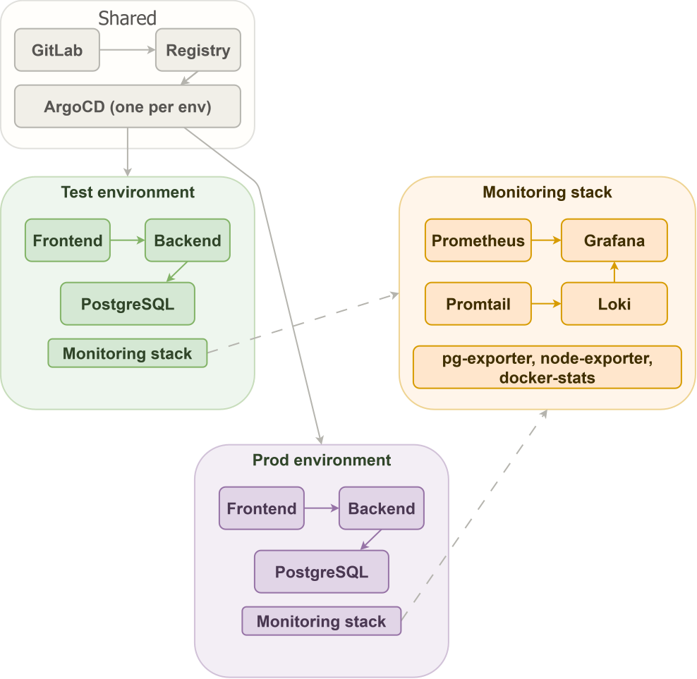

# Voyager

> This repository is configured as an educational project.
>
> **Don't attempt to clone and deploy this cluster manually unless you know what you are doing.**


Cloud migration project deploying a sample application to Google Cloud Platform using Kubernetes, Terraform, GitLab CI
and ArgoCD.

The sample app is a React frontend, Go backend and PostgreSQL database. It runs in two environments: test and prod,
managed from a single monorepo.

Here is a useful introductory video of what is [GitOps](https://youtu.be/GlG6Xr2HH1g?si=OUP8gvptOmqTS5A1&t=40)? 

---

## Architecture


---

## What's in this repo

```
argocd/        ArgoCD app-of-apps definitions for test and prod
sample-app/    Frontend and backend source code and Helm charts
terraform/     Infrastructure as code for shared, test and prod environments
ci/            Dockerfile used in the GitLab CI pipeline
```

---

## Infrastructure overview

Everything runs on GCP. The three GCP projects are:

- `tanel-shared` - shared resources: Artifact Registry, GitLab instance
- `tanel-test` - test environment
- `tanel-prod` - prod environment

Each environment has its own VPC, GKE cluster, Cloud SQL PostgreSQL database and DNS zones.

The GKE clusters use three node pools: `main` for the sample app, `monitoring` for Prometheus/Loki/Grafana and `tools`
for ArgoCD/External DNS/External Secrets.

---

## Domains

| URL                                               | What                |
|---------------------------------------------------|---------------------|
| https://www.cloud.tanelneitov.eu                  | Production frontend |
| https://backend.prod-public.cloud.tanelneitov.eu  | Production backend  |
| https://gitlab.cloud.tanelneitov.eu               | Self-managed GitLab |
| https://frontend.test-public.cloud.tanelneitov.eu | Test frontend       |
| https://backend.test-public.cloud.tanelneitov.eu  | Test backend        |

---

## Stack

| Layer              | Tool                                  |
|--------------------|---------------------------------------|
| Infrastructure     | Terraform                             |
| Container registry | GCP Artifact Registry                 |
| Kubernetes         | GKE Standard                          |
| GitOps             | ArgoCD                                |
| CI/CD              | GitLab CI                             |
| DNS                | GCP Cloud DNS + External DNS          |
| TLS                | GCP Managed Certificates              |
| Secrets            | GCP Secret Manager + External Secrets |
| Logs               | Loki + Grafana Alloy                  |
| Dashboards         | Grafana                               |
| Database           | Cloud SQL PostgreSQL                  |
| VPN                | WireGuard on GCE                      |

---

## Setup

### Prerequisites

- GCP organization with three projects: shared, test, prod
- Domain registered and root zone configured in shared project
- Terraform state buckets created in each project
- Admin user created with appropriate IAM roles, MFA enabled

### 1. Shared infrastructure

```bash
cd terraform/shared
terraform init
terraform apply
```

Creates Artifact Registry repositories and the self-managed GitLab instance.

### 2. Test and prod infrastructure

```bash
cd terraform/test
terraform init
terraform apply

cd terraform/prod
terraform init
terraform apply
```

Each creates a VPC, GKE cluster with three node pools, Cloud SQL database, DNS zones, NAT gateway and WireGuard VPN.

### 3. ArgoCD

ArgoCD is the only tool installed via Terraform Helm provider. Everything else is managed by ArgoCD itself using the
app-of-apps pattern.

```bash
# ArgoCD is installed as part of terraform apply via helm.tf
# After apply, get the initial password and log in
kubectl get secret argocd-initial-admin-secret -n argocd -o jsonpath='{.data.password}' | base64 -d
```

Then apply the root app-of-apps for the environment. ArgoCD will install everything else: External Secrets, External
DNS, Prometheus, Loki, Grafana, Alloy and the sample app.

### 4. CI/CD

The GitLab CI pipeline is configured in `.gitlab-ci.yml`. On every push to main it:

1. Runs backend tests
2. Builds and pushes Docker images to Artifact Registry
3. Builds and pushes Helm charts to Artifact Registry (OCI)
4. Deploys automatically to test via ArgoCD
5. Waits for manual approval before deploying to prod

A GitLab CI token for ArgoCD is stored as a CI/CD variable in GitLab.

---

## Monitoring

Grafana is available via port-forward or VPN at the internal DNS address.

```bash
kubectl port-forward svc/grafana 3000:80 -n monitoring
```

Dashboards included:

- Kubernetes cluster metrics
- PostgreSQL database metrics
- Sample application logs via Loki
- GCP cloud metrics

Prometheus alerts are configured and send notifications to Discord.

---

## VPN

A WireGuard VPN server runs on a GCE instance in each environment. Connect to it to access private DNS zones and
internal services.

The VPN server IP is output by Terraform:

```bash
cd terraform/prod
terraform output vpn_ip
```

Configure a WireGuard client with the server public key and the `10.200.0.0/24` subnet routed through the tunnel.

---

## Rollback

To roll back the sample app to a previous version, trigger the rollback pipeline in GitLab or use ArgoCD directly:

```bash
argocd app history frontend
argocd app rollback frontend <revision>
```

---

## Extras

- Self-managed GitLab CE running on a GCE instance in the shared project, accessible at
  `https://gitlab.cloud.tanelneitov.eu`
- WireGuard VPN for private access to internal resources in test and prod
- Optimized docker test image for running tests much faster, published to container registry
- ArgoCD Image updater, keeping applications up to date based on tags in the container registry
- Multi-AZ database, kept in multiple GCP datacenters to redundancy in prod environment
- Private DNS, with a vpn connection you can access any private applications in the VPC network